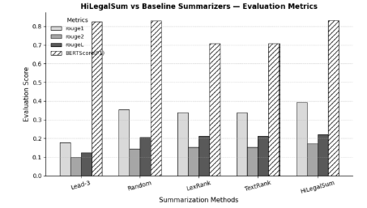

# HiLegalSum: Hybrid Legal Text Summarization

## Overview

HiLegalSum is a hybrid extractive text summarization framework designed specifically for legal documents.

Legal texts are typically long, complex, and filled with domain-specific terminology, making traditional summarization approaches less effective in preserving context and factual meaning.

The proposed framework combines semantic understanding, statistical weighting, positional importance, and graph-based ranking techniques to generate high-quality legal summaries that are coherent, informative, and less redundant.

## Live Demo

🔗 **Streamlit App:** [https://hilegalsum-legal-text-summarization-r4ecdh07so.streamlit.app/](https://extractive-summarization-9duvqc3vhtqzjkubyhqk4t.streamlit.app/)

Users can upload legal documents or paste bill text directly into the application and generate summaries interactively using the HiLegalSum framework.


## Problem Statement

Traditional extractive summarization methods such as TextRank and LexRank mainly rely on lexical similarity and sentence frequency.

While effective for generic text, these methods struggle with legal documents because legal language contains:

- Long and nested sentence structures
- Context-dependent terminology
- Critical legal references
- High semantic dependency between clauses

As a result, important legal meaning can be lost during summarization.

---

## Proposed Solution: HiLegalSum

HiLegalSum introduces a hybrid summarization architecture that integrates multiple scoring mechanisms to better capture legal context and semantic relevance.

### Key Features

- Sentence-BERT semantic embeddings
- TF-IDF sentence weighting
- Positional importance scoring
- Legal keyword relevance analysis
- Graph-based ranking using Eigenvector Centrality
- Redundancy reduction using Maximal Marginal Relevance (MMR)

These components collectively improve sentence selection quality and preserve contextual meaning in legal summaries.

---

## Workflow

1. Legal document preprocessing
2. Sentence segmentation
3. Semantic embedding generation using Sentence-BERT
4. TF-IDF and positional scoring
5. Legal keyword importance analysis
6. Graph construction and centrality scoring
7. Redundancy reduction using MMR
8. Final summary generation

---

## Dataset

The model was evaluated using the BillSum Dataset, which contains U.S. Congressional bills paired with expert-written summaries.

### Dataset Features

- Real-world legal documents
- Human-written reference summaries
- Suitable benchmark for legal summarization tasks

---

## Evaluation Metrics

The framework was evaluated using:

- ROUGE-1
- ROUGE-2
- ROUGE-L
- BERTScore (F1)
## Experimental Results

### Combined Evaluation Results

| Model | ROUGE-1 | ROUGE-2 | ROUGE-L | BERTScore (F1) |
|------|------|------|------|------|
| Lead-3 | 0.1801 | 0.0990 | 0.1251 | 0.8251 |
| Random | 0.3452 | 0.1353 | 0.1978 | 0.8281 |
| LexRank | 0.3247 | 0.1478 | 0.2050 | 0.6895 |
| TextRank | 0.3247 | 0.1478 | 0.2050 | 0.6895 |
| **HiLegalSum** | **0.3876** | **0.1765** | **0.2243** | **0.8329** |

---

## Ablation Study

| Variant | Description | ROUGE-L | BERTScore (F1) |
|------|------|------|------|
| 0 | Base TF-IDF | 0.1921 | 0.8241 |
| 1 | + Position | 0.2017 | 0.8289 |
| 2 | + Legal Keywords | 0.2089 | 0.8332 |
| 3 | + Graph Centrality (HiLegalSum) | 0.2243 | 0.8329 |

---

## Comparative Graph


Comparative Analysis

Experimental results demonstrate that HiLegalSum consistently outperforms traditional baseline methods across all evaluation metrics.

The inclusion of:

semantic embeddings,
legal keyword weighting,
and graph centrality scoring

significantly improves summary quality and contextual relevance.

The ablation study further confirms that each module contributes positively to the overall system performance.

## Technologies Used

- Python
- Google Colab
- Sentence-BERT
- Scikit-learn
- NetworkX
- NumPy
- Pandas
- Matplotlib

---

## Installation

Clone the repository:

```bash
git clone https://github.com/bindusri2605/extractive-summarization.git
```

Install dependencies:

```bash
pip install -r requirements.txt
```

---

## Run the Project

```bash
python main.py
```

Or open the notebook in Google Colab and execute all cells.

---

## Future Improvements

- Abstractive legal summarization
- Fine-tuned transformer models for legal datasets
- Multi-document legal summarization
- Explainable AI integration for legal reasoning
- Real-time legal document summarization systems

---

## Conclusion

HiLegalSum demonstrates that combining semantic understanding with graph-based ranking and legal-aware features significantly improves extractive summarization performance in the legal domain.

The framework effectively preserves factual content, reduces redundancy, and generates contextually meaningful summaries for complex legal documents.

---

## Author

**Bindu Duggisetty**  
Integrated M.Tech Software Engineering  
VIT-AP University
